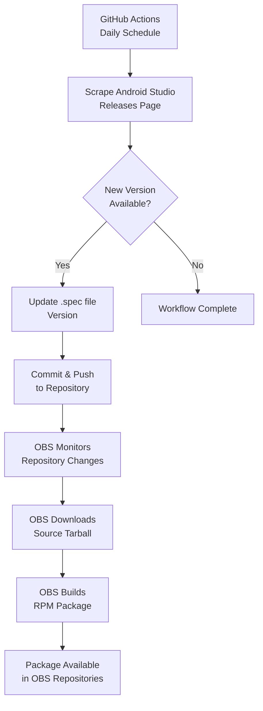

# 🚀 Automated Android Studio RPM Packager for OBS

[](https://github.com/itachi-re/android-studio-obs/actions)
[](https://build.opensuse.org/projects/home:itachi_re/packages/android-studio/repositories/openSUSE_Tumbleweed/binaries)
[](LICENSE)

This project provides **fully automated RPM packaging** for the latest stable version of Android Studio, specifically designed for Open Build Service (OBS) and compatible Linux distributions (openSUSE, Fedora, etc.).

## ✨ Features

- **🤖 Fully Automated**: Daily checks for new Android Studio versions
- **⚡ Rapid Updates**: Automatically builds new releases within hours of publication
- **🔧 OBS Integration**: Seamless integration with Open Build Service
- **🔄 Multiple Fallbacks**: Robust version detection using multiple sources
- **📦 Clean Packaging**: Properly installs to `/opt/android-studio` with desktop integration
- **🛠️ Manual Control**: Includes manual trigger options and local update scripts

## 🏗️ System Architecture



## 📁 Project Structure

```
.
├── 📄 android-studio.spec          # RPM specification file
├── 🔧 .github/workflows/
│   └── updater.yml                 # Automated version checker
├── ⚙️ _service                     # OBS service configuration
├── 🛠️ update.sh                   # Manual update script
└── 📖 README.md                   # This file
```

## 🚀 Quick Start

### For End Users

Install Android Studio from the OBS repository:

```bash
# Add the repository (replace with your OBS repo URL)
sudo zypper addrepo https://download.opensuse.org/repositories/home:username/openSUSE_Tumbleweed/home:username.repo
sudo zypper refresh
sudo zypper install android-studio
```

### For Package Maintainers

1. **Fork this repository** and set up the OBS package:

```bash
# In your OBS project
osc meta pkg -e your_project android-studio
# Add the _service file configuration
```

2. **Configure GitHub Secrets** (if needed):
   - Set up repository permissions for automated commits
   - Configure any required API tokens

3. **The automation will handle the rest!**

## 🔧 Manual Operations

### Trigger Manual Update

```bash
# Run the manual update script
./update.sh

# Or trigger GitHub Actions manually
# 1. Go to Actions tab in your repository
# 2. Select "Check for Android Studio Updates"
# 3. Click "Run workflow"
```

### Local Development

```bash
# Clone the repository
git clone https://github.com/YOUR_USERNAME/YOUR_REPO.git
cd YOUR_REPO

# Test the update script
chmod +x update.sh
./update.sh

# Build locally (if you have rpmbuild)
rpmbuild -ba android-studio.spec
```

## ⚙️ Configuration

### GitHub Actions Schedule

The workflow runs daily at 06:00 UTC. To modify the schedule, edit `.github/workflows/updater.yml`:

```yaml
schedule:
  - cron: '0 6 * * *'  # Daily at 06:00 UTC
```

### OBS Service Configuration

The `_service` file controls how OBS interacts with this repository:

```xml
<service name="obs_scm">
  <param name="url">https://github.com/YOUR_USERNAME/YOUR_REPO</param>
  <param name="filename">android-studio.spec</param>
  <param name="revision">main</param>
</service>
```

## 🛠️ Technical Details

### Version Detection

The system employs multiple fallback methods for robust version detection:

1. **Primary**: Official Android Studio releases page scraping
2. **Secondary**: AUR PKGBUILD parsing (manual script)
3. **Tertiary**: Direct download URL probing

### Package Structure

- **Installation Path**: `/opt/android-studio/`
- **Desktop Entry**: `android-studio.desktop`
- **Binary Symlink**: `/usr/local/bin/android-studio`
- **Icons**: Properly installed in icon themes

## 🤝 Contributing

We welcome contributions! Please feel free to:

- Report issues and bugs
- Suggest new features
- Submit pull requests
- Improve documentation

### Development Setup

1. Fork the repository
2. Create a feature branch: `git checkout -b feature/amazing-feature`
3. Commit your changes: `git commit -m 'Add amazing feature'`
4. Push to the branch: `git push origin feature/amazing-feature`
5. Open a pull request

## 📝 License

This project is licensed under the MIT License - see the [LICENSE](LICENSE) file for details.

## 🙏 Acknowledgments

- **Google Android Team** for Android Studio
- **Open Build Service** team for the excellent packaging infrastructure
- **Arch Linux AUR** maintainers for version reference
- **GitHub** for hosting and Actions automation

## 📊 Status

| Component | Status | Details |
|-----------|--------|---------|
| Automated Updates | ✅ Active | Daily checks via GitHub Actions |
| OBS Integration | ✅ Active | Automatic build triggers |
| Multi-distro Support | ✅ Working | openSUSE, Fedora, etc. |
| Version Detection | ✅ Robust | Multiple fallback methods |

---

**Maintained with ❤️ for the Linux development community**

*Automation makes life better!* 🤖
