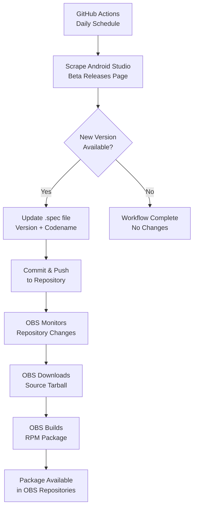

# 🚀 Automated Android Studio (Beta) RPM Packager for OBS

[](https://github.com/itachi-re/android-studio-obs/actions)
[](https://build.opensuse.org/projects/home:itachi_re/packages/android-studio/repositories/openSUSE_Tumbleweed/binaries)
[](https://build.opensuse.org/package/show/home:itachi_re/android-studio)
[](LICENSE)

Fully automated RPM packaging for the **latest Android Studio Beta channel** release, designed for Open Build Service (OBS) and compatible Linux distributions (openSUSE, Fedora, etc.).

> **Note:** This package tracks the **Beta channel** of Android Studio. The product name is patched at build time to display as *Android Studio Beta* to distinguish it from a stable channel install.

---

## ✨ Features

- **🤖 Fully Automated** — Daily checks for new Android Studio Beta releases via GitHub Actions
- **⚡ Rapid Updates** — New releases are built within hours of publication
- **🔧 OBS Integration** — Seamless integration with Open Build Service
- **🔄 Robust Detection** — Multiple fallback methods for version scraping
- **📦 Clean Packaging** — Installs to `/usr/share/android-studio` with proper desktop and icon integration
- **🛠️ Manual Control** — Includes manual trigger options and a local update script

---

## 🏗️ System Architecture


```mermaid
graph TB
    A[GitHub Actions<br>Daily Schedule] --> B[Scrape Android Studio<br>Beta Releases Page]
    B --> C{New Version<br>Available?}
    C -->|Yes| D[Update .spec file<br>Version + Codename]
    D --> E[Commit & Push<br>to Repository]
    E --> F[OBS Monitors<br>Repository Changes]
    F --> G[OBS Downloads<br>Source Tarball]
    G --> H[OBS Builds<br>RPM Package]
    H --> I[Package Available<br>in OBS Repositories]
    C -->|No| J[Workflow Complete<br>No Changes]
```

---

## 📦 Package Details

| Property | Value |
|----------|-------|
| Channel | Beta |
| Architecture | x86_64 |
| Install path | `/usr/share/android-studio/` |
| Binary symlink | `/usr/bin/android-studio` |
| Desktop entry | `/usr/share/applications/android-studio.desktop` |
| Icon | `/usr/share/pixmaps/android-studio.png` |
| Licenses | `/usr/share/licenses/android-studio/` |

---

## 📁 Project Structure

```
.
├── android-studio.spec          # RPM specification file
├── android-studio.rpmlintrc     # rpmlint suppression rules
├── _service                     # OBS source service configuration
├── .github/workflows/
│   └── updater.yml              # Automated version checker workflow
├── update.sh                    # Manual local update script
└── README.md                    # This file
```

---

## 🚀 Quick Start

### For End Users

Install Android Studio (Beta) from the OBS repository:

```bash
# Add the repository
sudo zypper addrepo https://download.opensuse.org/repositories/home:/itachi_re/openSUSE_Tumbleweed/home:itachi_re.repo
sudo zypper refresh

# Install the package
sudo zypper install android-studio
```

Then launch from your application menu or run:

```bash
android-studio
```

### For Package Maintainers

1. **Fork this repository** and create your OBS package:

```bash
osc meta pkg -e your_project android-studio
```

2. Copy the `_service`, `android-studio.spec`, and `android-studio.rpmlintrc` files into your OBS package directory.

3. **Configure GitHub Secrets** if needed:
   - `GITHUB_TOKEN` is sufficient for automated commits if Actions has write permissions enabled in your repo settings.

4. The automation handles the rest — version bumps, OBS triggers, and builds.

---

## 🔧 Manual Operations

### Trigger a Manual Version Check

```bash
# Run the local update script
chmod +x update.sh
./update.sh
```

Or trigger it from GitHub:
1. Go to the **Actions** tab in your repository
2. Select **Check for Android Studio Updates**
3. Click **Run workflow**

### Local Build (for testing)

```bash
git clone https://github.com/itachi-re/android-studio-obs/
cd android-studio-obs

# Requires rpmbuild and the source tarball to be downloaded manually
rpmbuild -ba android-studio.spec
```

---

## ⚙️ Configuration

### GitHub Actions Schedule

The workflow runs daily at **06:00 UTC**. To change the schedule, edit `.github/workflows/updater.yml`:

```yaml
schedule:
  - cron: '0 6 * * *'  # Daily at 06:00 UTC
```

### OBS Service Configuration

The `_service` file below is **abbreviated for illustration** — the actual file in the repository includes additional services (`set_version`, `download_files`, `tar`, `recompress`) required for a working OBS build. Do not copy this snippet verbatim:

```xml
<!-- Abbreviated — see _service in repo for the full configuration -->
<service name="obs_scm">
  <param name="url">https://github.com/itachi-re/android-studio-obs/</param>
  <param name="filename">android-studio.spec</param>
  <param name="revision">main</param>
</service>
```

---

## 🛠️ Technical Details

### Version Detection

Multiple fallback methods are used for robust version detection:

1. **Primary** — Official Android Studio releases page scraping
2. **Secondary** — AUR PKGBUILD parsing (via `update.sh`)
3. **Tertiary** — Direct download URL probing

### Beta Branding Patch

Since this package coexists with the stable channel, the build patches `lib/resources.jar` at `%prep` time to rename the product to *Android Studio Beta* internally:

```bash
bsdtar -xf lib/resources.jar idea/AndroidStudioApplicationInfo.xml
sed -i 's/"Studio"/"Studio Beta"/' idea/AndroidStudioApplicationInfo.xml
zip -u lib/resources.jar idea/AndroidStudioApplicationInfo.xml
```

### Codename Handling

Google embeds a release codename (e.g. `quail1-patch1`) in the source tarball filename, which changes with each release family. This is tracked via a `%define studio_codename` macro in the spec and updated by the automation script alongside the version number.

---

## 🤝 Contributing

Contributions are welcome:

- Report bugs or packaging issues via [GitHub Issues](https://github.com/itachi-re/android-studio-obs/issues)
- Submit pull requests for spec improvements, workflow fixes, or documentation updates

### Development Workflow

```bash
# Fork and clone
git clone https://github.com/your-fork/android-studio-obs/
cd android-studio-obs

# Create a feature branch
git checkout -b fix/something-broken

# Make changes, then push
git add .
git commit -m "fix: describe what you changed"
git push origin fix/something-broken

# Open a pull request on GitHub
```

---

## 📊 Status

| Component | Status | Details |
|-----------|--------|---------|
| Automated Updates | ✅ Active | Daily checks via GitHub Actions |
| OBS Integration | ✅ Active | Automatic build triggers |
| Architecture | ✅ x86_64 | Beta channel only ships x86_64 upstream |
| Version Detection | ✅ Robust | Multiple fallback methods |
| Beta Branding | ✅ Patched | Safe to install alongside stable |

---

## 📝 License

This project is licensed under the MIT License — see the [LICENSE](LICENSE) file for details.

Android Studio itself is subject to [its own license terms](https://developer.android.com/studio/terms).

---

## 🙏 Acknowledgments

- **Google Android Team** for Android Studio
- **Open Build Service** team for the packaging infrastructure
- **Arch Linux AUR** maintainers for version reference

---

*Automation makes life efficient.* 🤖
